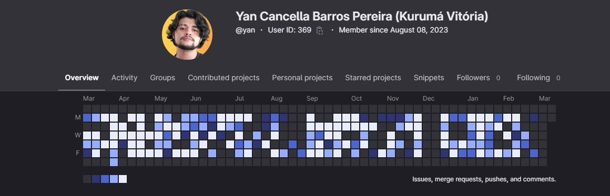

<h1 align="center">Yan Cancella Barros Pereira</h1>

  <h3>Full Stack Developer | TypeScript | Next.js | Node.js | Vue.js | PHP</h3>
  

    
    
   
  

<h2>👨‍💻 About Me</h2>

  I'm a Full Stack Developer with extensive experience in developing and maintaining scalable web systems, focusing on task automation, performance optimization, and security. My expertise includes technologies such as React.js, Next.js, and PHP, alongside RESTful API integration and management of MySQL and PostgreSQL databases. I'm proficient in version control tools like Git and have knowledge in Docker, Kubernetes, and cloud services like AWS and Azure for application deployment and scalability.

<h2>🚀 Professional Experience</h2>

<h3>Full Stack Developer - Mid Level | Grupo Águia Branca (July 2023 - March 2025)</h3>
<ul>
  <li>Development and maintenance of APIs and websites using TypeScript, Node.js, and Next.js.</li>
  <li>Led the development and maintenance of BYD Vitória Motors website and Toyota ES/BH/BSB website.</li>
  <li>Created and led an integrated CMS for banner management across both sites.</li>
  <li>Developed a robust API with secure authentication, complete CRUD functionality, and Followize integration for form data.</li>
  <li>Implemented Python scripts for image conversion to WebP and mass resizing, as well as customer data validation.</li>
  <li>Reduced loading time of the Toyota ES/BH/BSB website by 40% after optimizations.</li>
</ul>

<h3>Junior Full Stack Developer | Globalsys (June 2022 - July 2023)</h3>
<ul>
  <li>Created and maintained solutions using Vue.js, React, PHP, and GraphQL.</li>
  <li>Developed solutions for clients like Jurong and GVBus, addressing specific business needs.</li>
  <li>Built websites like Happn (real estate platform) with API integration and optimized interfaces.</li>
</ul>

<h2>💻 Technical Skills</h2>

<table>
  <tr>
    <td>Languages</td>
    <td>TypeScript, JavaScript, Python, PHP, C#, GO</td>
  </tr>
  <tr>
    <td>Frameworks & Libraries</td>
    <td>Next.js, Node.js, Vue.js, React, Laravel, Express, Nest.js, Angular, Svelte</td>
  </tr>
  <tr>
    <td>Databases</td>
    <td>MySQL, PostgreSQL, Redis, SQLite, MariaDB, Oracle, SQL Server, MongoDB</td>
  </tr>
  <tr>
    <td>Tools & Processes</td>
    <td>Git, Docker, Followize, Custom CMS, Python Scripts, Bash Scripts, Linux</td>
  </tr>
  <tr>
    <td>Infrastructure</td>
    <td>Microsoft Azure, AWS, Google Cloud, Digital Ocean, Vercel, Cloudflare</td>
  </tr>
  <tr>
    <td>Queue Systems</td>
    <td>RabbitMQ, BullMQ, Redis</td>
  </tr>
</table>

<h2>🖥️ Personal Portfolio</h2>

  
  
<strong>Check out my Windows-inspired portfolio website!</strong>

  
A unique, interactive portfolio experience based on classic Windows interfaces

<h2>🌟 Portfolio Highlights</h2>

<ul>
  <li><a href="https://vitoriamotorsbyd.com.br" target="_blank">vitoriamotorsbyd.com.br</a> - BYD Vitória Motors</li>
  <li><a href="https://azulagromaquinas.com.br" target="_blank">azulagromaquinas.com.br</a> - Azul Agro</li>
  <li><a href="https://kurumaveiculos.com.br" target="_blank">kurumaveiculos.com.br</a> - Kuruma Veículos</li>
  <li><a href="https://osakaveiculos.com.br" target="_blank">osakaveiculos.com.br</a> - Osaka Veículos</li>
  <li><a href="https://toyotakyoto.com.br" target="_blank">toyotakyoto.com.br</a> - Toyota Kyoto</li>
  <li><a href="https://lexusvitoria.com.br" target="_blank">lexusvitoria.com.br</a> - Lexus Vitória</li>
  <li><a href="https://lexusbrasilia.com.br" target="_blank">lexusbrasilia.com.br</a> - Lexus Brasília</li>
  <li><a href="https://lexusbh.com.br" target="_blank">lexusbh.com.br</a> - Lexus BH</li>
</ul>

<h2>⚠️ About My GitHub Commits</h2>

  You may notice that my GitHub profile doesn't showcase many public commits. This is because throughout my entire career, I've been dedicated to professional projects where code is stored in private corporate repositories. Most of my work has been contributed to private GitLab instances maintained by the companies I've worked for.

  Below is a screenshot of my professional GitLab activity, demonstrating my consistent contributions to enterprise-level projects:

<!-- Insert your GitLab commits screenshot here -->

  

<h2>🔍 What I'm Looking For</h2>

  I'm passionate about developing scalable, efficient, and secure applications that solve real-world problems. I thrive in collaborative environments where I can apply my technical expertise while continuing to learn and grow as a developer.

<h2>💭 Fun Fact</h2>

  <pre><code>const myFavorite = ['JavaScript', '.map()', 'function'].map(item => `❤️ ${item}`).join(' ');</code></pre>
  
If I had to pick one JavaScript feature I couldn't live without, it would definitely be <code>.map()</code>! There's something incredibly satisfying about transforming data with such elegant, functional syntax.

  Thank you for visiting my profile! Feel free to reach out if you'd like to connect or collaborate.

